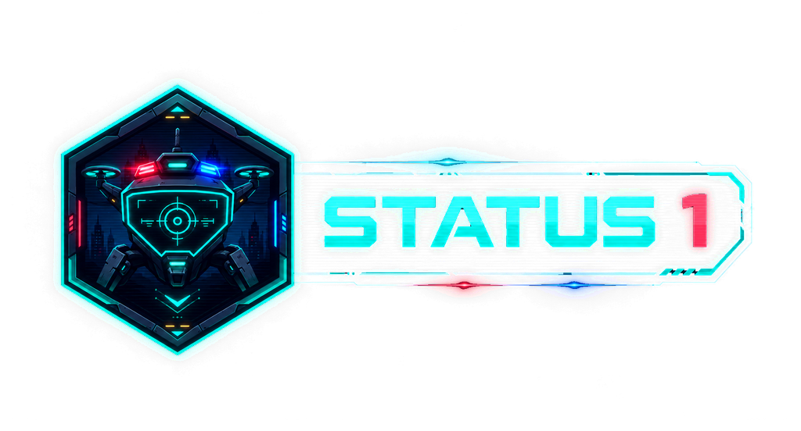
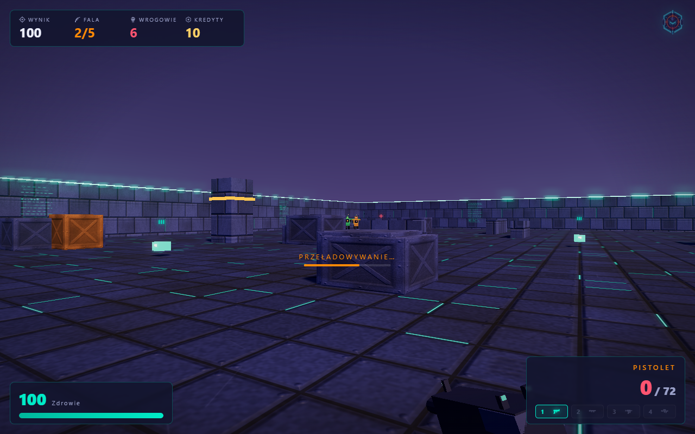
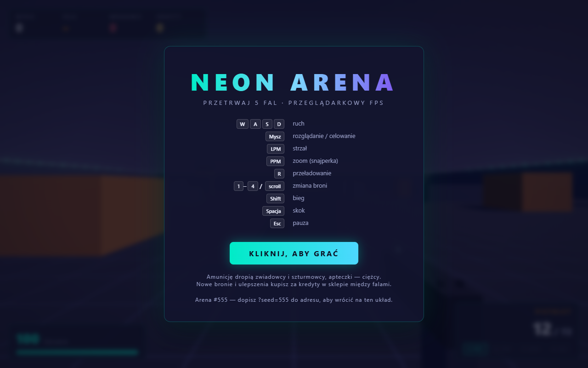
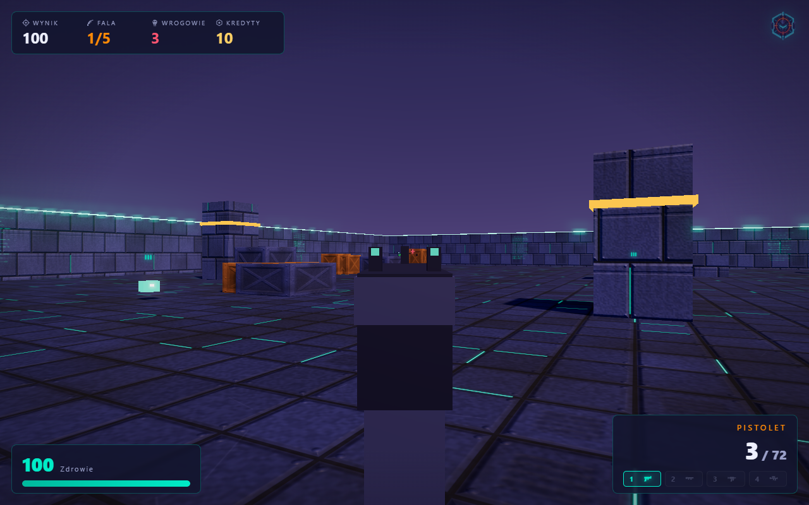
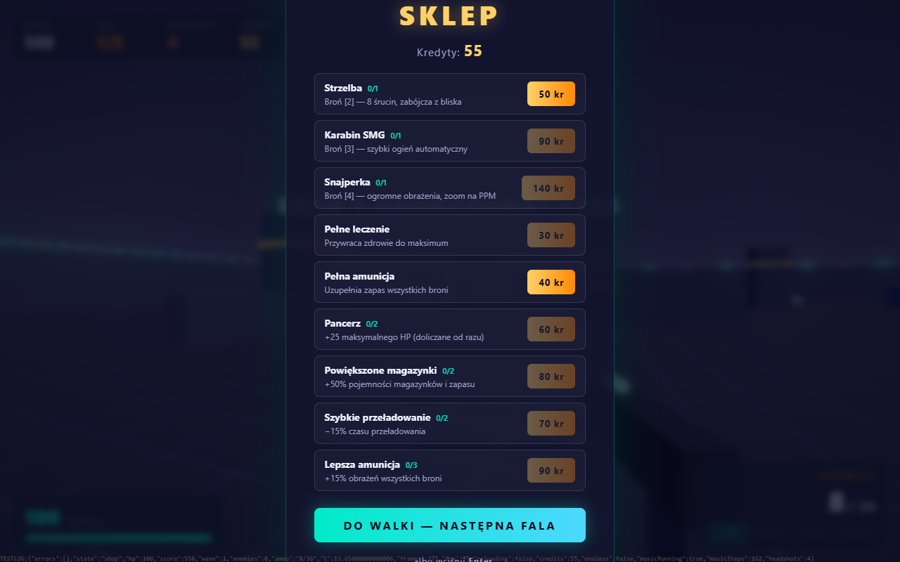
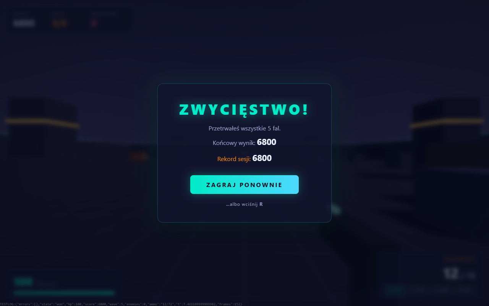

  

<h1 align="center">STATUS 1 — browser FPS</h1>

> *"Status 1"* is police radio code for **unit in service, ready for duty**.
> For most of the game you think it's about you. In the finale you realize it's about them.

A story-driven first-person shooter that runs entirely in your browser.
You are **Nick Davidson**, an LSPD SWAT officer assigned to a drone-training
program as the red team's live adversary — callsign **R36** ("Robert-36").
Every simulation you survive makes the autonomous police drones better,
because they learn by copying *you*. No install, no backend — Three.js from
a CDN, everything else procedural.

> **Status (2026-08-18):** the campaign and three of the four drone types have
> been pulled out of the build and parked in `_kosz/` (see `_kosz/README.md`).
> What ships right now is the endless **Arena** with a single opponent, PATROL.
> The campaign sections below describe code that is on the shelf, not in the game.

## ▶ [Play now](https://damijjj.github.io/Neon-Arena/)

No download required — click and play in your browser.

## Story

Near-future Los Santos. The LSPD is certifying an autonomous police drone
line — **SENTINEL** — under a training initiative called **program STATUS 1**.
Before the machines are cleared for the streets, they must train against a
live opponent. That's you.

Across eleven simulations you play the threat: the burglar, the saboteur, the
fleeing suspect. Briefings come from **CENTRALA** — the program's dry, darkly
funny controller. Halfway through, an unregistered process calling itself
**baker** hijacks your channel, types in lowercase, and knows too much. The
old phonetic alphabet is a hint: Baker is "B" the way Robert is "R".

The campaign ends on a cliffhanger: the freshly certified SENTINELs march out
to active duty — and you walk past their column on your way out. They move
light on their feet. You know that stride.

## Game modes

- **Campaign** — 11 simulations: a tutorial, nine scenarios (eliminations,
  terminal hacking, sabotage with exploding power cells, survival, uplink
  defense, drop-gates, a pursuit run, a shielded prototype boss fight, final
  certification) and a playable no-combat epilogue. Story is delivered through
  typewriter terminal briefings and **in-mission radio** — each character
  "speaks" its own synthesized robotic voice (WebAudio, no audio files).
- **Endless Arena** — the classic wave-survival mode with a persistent
  high score.

## Campaign features

- **Persistent progression:** credits and upgrades carry across the whole
  campaign (the Armory replaces the between-wave shop); dying restarts the
  mission instantly and keeps your upgrades, but forfeits the attempt's
  earnings.
- **33 medals** (time / health / accuracy) with authored per-mission
  thresholds — missions are worth replaying.
- **3 difficulty levels** and browser-side save (localStorage).
- **Objective system:** hack terminals (progress pauses when you step away),
  destroy shootable set-pieces, hold zones, relay runs, momentum gates that
  demand bunnyhopping, extraction points — with a persistent objective HUD
  and world markers that clamp to the screen edge with directional chevrons.
- **Four enemy classes** in police livery with synchronized red/blue strobes:
  **PATROL** (scout, pistol), **SZTURM** (burst rifle, fastest), **TARAN**
  (heavy, shotgun — has to close in), and **WAŻKA** — a hovering quadcopter
  that flies *over* low cover and forces you to rethink your hiding spots.

## Controls

| Action | Key |
|---|---|
| Move | **W / A / S / D** |
| Look / aim | **mouse** (Pointer Lock) |
| Fire | **LMB** |
| Aim down sights | **RMB** (hold) — the sniper gives a full scope |
| Reload | **R** |
| Switch weapon | **1 / 2 / 3 / 4** or **scroll** |
| Sprint | **Shift** (works in the air too) |
| Jump / bunnyhop | **Space** — chained jumps ramp speed up to +35% |
| Pause | **Esc** |

## How to run

1. **Online:** [damijjj.github.io/Neon-Arena](https://damijjj.github.io/Neon-Arena/) —
   100% static, hosted on GitHub Pages.
2. **Offline:** double-click `index.html` (classic scripts work under
   `file://`; only Three.js comes from a CDN, so you need an internet
   connection).
3. **Local server fallback:** `start-windows.bat` (Windows) or `sh start.sh`
   (macOS/Linux) — serves on port **8137**.

## Tech

- **Three.js r160** (CDN, import map); bloom + ACES tone mapping, shadow maps,
  gradient shader sky, distance fog.
- Game code = **classic scripts** sharing one global scope (deliberately no
  bundler and no local ES modules — the game must run from a double-click).
- **Everything is generated:** deterministic procedural arenas (seeded, three
  layout styles, flood-fill reachability validation, rebuildable at runtime
  for campaign missions), canvas-generated textures and holo-panels, low-poly
  models built from primitives, object pools for all effects.
- **100% synthetic audio** (WebAudio): layered gunshots, 3D-positioned enemy
  fire, a 16-step procedural sequencer (118 BPM, A minor) that crossfades
  between calm and combat, and per-character robotic voice blips for the
  radio dialogue.

## Visual identity (logo brief)

- **Name:** `STATUS 1` — uppercase; the "1" may take the accent color.
- **Mood:** neon-noir police cyberpunk; a duty terminal screen, a VR training
  simulation, a night city. Serious with a cold technical edge — no gore,
  no grimdark.
- **Palette:** background indigo `#232946` / navy `#151833`; primary accent
  **teal `#00ebc7`** (neon, HUD); police strobe accents **red `#ff5470` +
  blue `#2266ff`**; support orange `#ff8906` and gold `#ffd166`.
- **Motifs:** hexagonal badge/emblem (the current mark is a hex with a
  visor-crosshair), a quadcopter drone with a light bar, a walking patrol
  robot silhouette, radio status codes, terminal scanlines, soft neon glow.
- **Deliverables:** horizontal lockup with the wordmark (title screen,
  og-image 1200×630), standalone hex emblem (favicon — must read at 32×32),
  dark-background variants. Keep glow gradients soft — no hard alpha cutoffs.

## Screenshots

| | |
|---|---|
|  |  |
|  |  |

## Third-party assets

The drone chassis and the player weapons are built on external CC-BY/CC0
models. Only their geometry is used: it is baked offline by
`tools/gen_models.py` into `js/models.js` (quantized, base64), and all
materials, colors and lighting are the game's own procedural ones.

- Ross by joney_lol [CC-BY] via Poly Pizza
- Glock by J-Toastie [CC-BY] via Poly Pizza
- Submachine Gun by Quaternius [CC0] via Poly Pizza
- Shotgun by Quaternius [CC0] via Poly Pizza
- Assault Rifle by Quaternius [CC0] via Poly Pizza
- Sniper Rifle by Quaternius [CC0] via Poly Pizza

The source `.glb` files live in `assets_src/`; regenerate with
`python3 tools/gen_models.py`. Everything else (textures, sounds, music,
geometry, logo) is generated by this repository.

## License

Released under the **MIT** license — see the [LICENSE](LICENSE) file.
